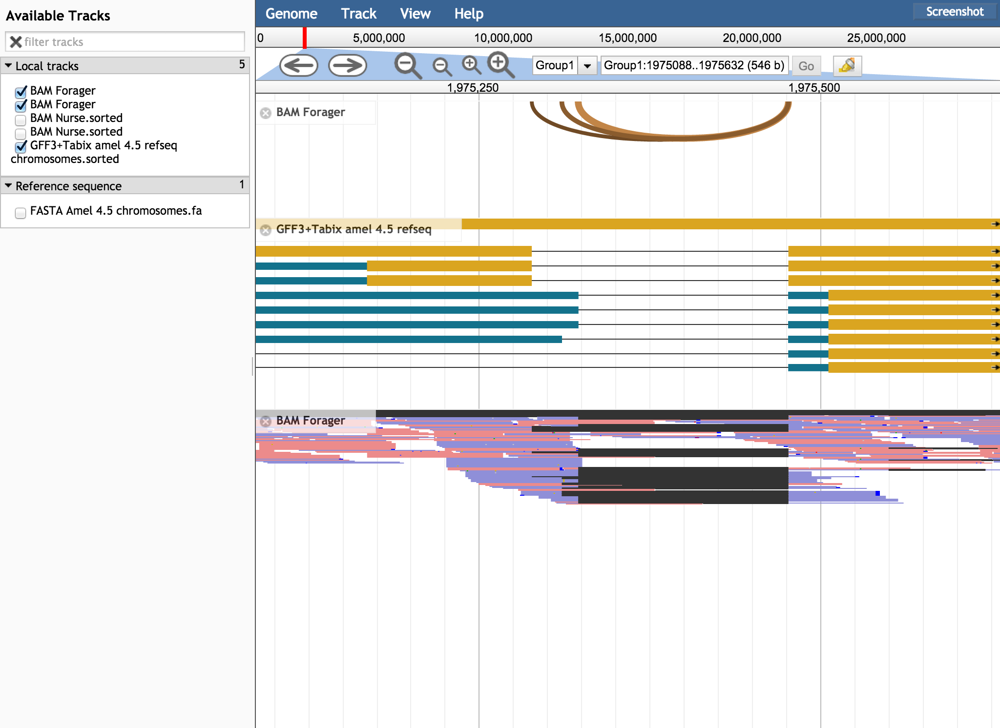
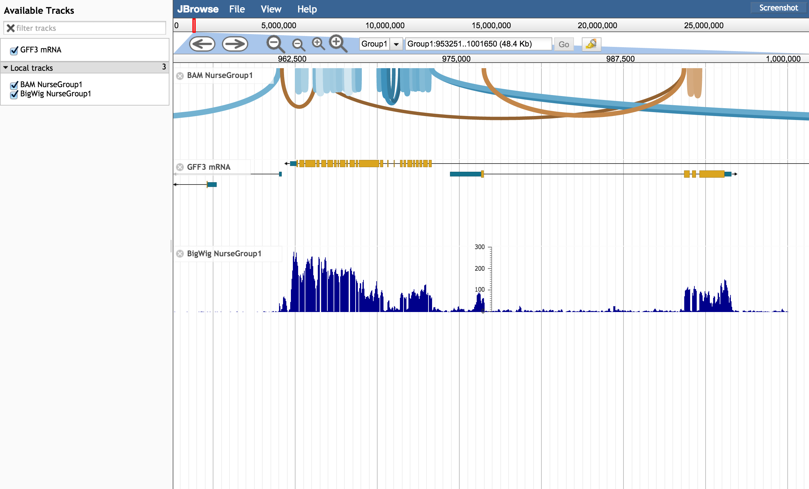

# sashimiplot

A JBrowse implementation of the sashimi plot style tool. Features a storeclass that converts RNA-seq BAM files into intron support coverage features, a track type that adds menu options, and a featureglyph that draws arcs.

## Track options

* style->color - color (RGB,HSL,hex) or callback function returning a color
* style->height - integer height or callback function returning height of the bezier curves 
* useXS - a built-in option to change color according to the XS tag (which indicates strand, inferred from canonical splice sites)
* readDepthFilter - a built-in option to filter out any junctions that have low coverage. Can also be adjusted from the menu options

Other options on the BAM store tracks can apply, such as chunkSizeLimit

## Example track config

      {
          "label": "Nurse_junctions",
          "storeClass": "JBrowse/Store/SeqFeature/BAM",
          "type": "SashimiPlot/View/Track/Sashimi",
          "urlTemplate": "Nurse.bam",
          "chunkSizeLimit": 50000000,
          "useXS": true
      }
